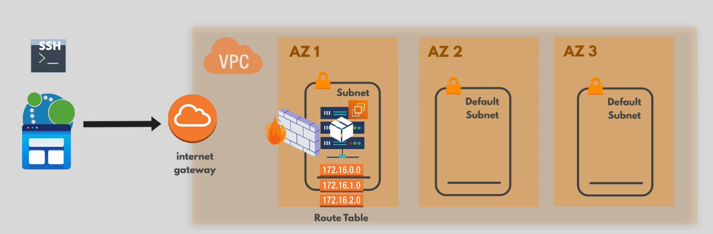

# Infrastructure Terraform AWS - Lab 1

Ce projet Terraform permet de provisionner une infrastructure AWS de base pour héberger une application web sur une machine EC2. Il a été conçu comme un laboratoire d’apprentissage pour découvrir la création d’infrastructures as code avec Terraform, la modularisation et la gestion des ressources AWS.

## 1. Objectif du projet

L’objectif de ce laboratoire est de déployer une architecture simple et fonctionnelle comprenant :

- un VPC privé dédié à l’application ;
- un sous-réseau public ;
- une passerelle Internet pour permettre l’accès extérieur ;
- une table de routage permettant l’accès à Internet ;
- un groupe de sécurité pour restreindre les accès réseau ;
- une instance EC2 avec une clé SSH et un accès public.

Cette infrastructure sert de base pour héberger une application web ou un service simple accessible via l’IP publique de l’instance.

## 2. Architecture déployée




### Composants principaux

- VPC : réseau logique principal isolé.
- Subnet public : sous-réseau utilisé par l’instance EC2.
- Internet Gateway : permet au sous-réseau public d’accéder à Internet.
- Route Table : dirige le trafic sortant vers l’Internet Gateway.
- Security Group : autorise l’accès SSH depuis une adresse IP donnée et l’accès au port 8080 depuis Internet.
- EC2 Instance : machine virtuelle exécutant l’application ou le service.

## 3. Structure du projet

```text
lab-1/
├── main.tf
├── variables.tf
├── outputs.tf
├── terraform.tfvars
├── modules/
│   ├── subnet/
│   │   ├── main.tf
│   │   ├── variables.tf
│   │   └── outputs.tf
│   └── webserver/
│       ├── main.tf
│       ├── variables.tf
│       └── outputs.tf
└── images/
    └── architecture.png
```

## 4. Prérequis

Avant de lancer ce projet, assurez-vous d’avoir :

- un compte AWS actif ;
- les identifiants AWS configurés localement ;
- Terraform installé sur votre machine ;
- une clé SSH publique disponible localement ;
- un accès réseau autorisé depuis votre adresse IP pour le port 22 (SSH).

## 5. Variables utilisées

Le fichier variables.tf définit les paramètres nécessaires au déploiement. Voici les principaux :

- my_vpc_cidr_block : plage CIDR du VPC.
- my_subnet_cidr_block : plage CIDR du sous-réseau.
- avail_zone : zone de disponibilité / région AWS utilisée.
- env_prefix : préfixe utilisé pour nommer les ressources.
- my_ip : adresse IP autorisée pour l’accès SSH.
- instance_type : type d’instance EC2.
- public_key_location : chemin vers la clé publique SSH.
- image_name : filtre permettant de sélectionner l’AMI souhaitée.
- access_key : clé d’accès AWS.
- secret_key : clé secrète AWS.

Le fichier terraform.tfvars contient des valeurs d’exemple. Il est recommandé de les ajuster selon votre environnement.

## 6. Déploiement

### Étape 1 : initialiser Terraform

```bash
terraform init
```

### Étape 2 : prévisualiser les changements

```bash
terraform plan
```

### Étape 3 : appliquer la configuration

```bash
terraform apply
```

Terraform va alors créer l’infrastructure AWS décrite dans les fichiers du projet.

## 7. Vérification et accès

Après le déploiement, vous pouvez récupérer l’IP publique de l’instance EC2 à partir de la sortie Terraform.

### Connexion SSH

```bash
ssh -i /chemin/vers/votre/clef_privée ubuntu@<ip-publique>
```

### Accès à l’application

Si votre application est exposée sur le port 8080, vous pourrez y accéder via :

```text
http://<ip-publique>:8080
```

## 8. Ressources créées

Le déploiement crée les ressources suivantes :

1. VPC
2. Sous-réseau public
3. Passerelle Internet (gateway)
4. Table de routage par défaut mise à jour
5. Groupe de sécurité
6. Paire de clés SSH
7. Instance EC2

## 9. Modules utilisés

### Module subnet

Le module subnet est responsable de la création du sous-réseau public, de la passerelle Internet et de la table de routage associée.

### Module webserver

Le module webserver gère la création du groupe de sécurité, de la paire de clés SSH et de l’instance EC2.

## 10. Notes importantes

- Le groupe de sécurité autorise l’accès SSH depuis l’adresse IP définie dans my_ip.
- L’accès au port 8080 est ouvert à toutes les adresses IP pour faciliter les tests, mais cette configuration peut être renforcée en production.
- Les identifiants AWS sensibles doivent être conservés en sécurité et ne jamais être stockés en clair dans un dépôt public.
- Il est recommandé d’utiliser des variables sensibles via un fichier de variables sécurisé ou des variables d’environnement.

## 11. Exemple de workflow recommandé

```bash
terraform init
terraform plan
terraform apply -auto-approve
terraform destroy
```

## 12. Conclusion

Ce laboratoire offre une première expérience pratique de l’automatisation du déploiement sur AWS avec Terraform. Il permet de comprendre les bases de la création d’infrastructures cloud, de la modularisation et de la gestion des ressources via du code.
